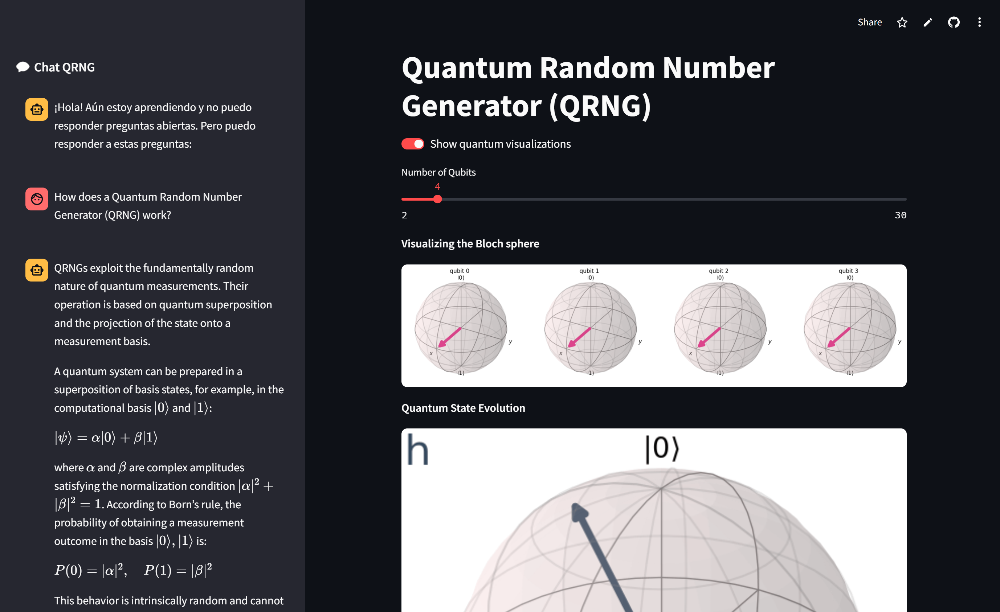

# Quantum-Random-Number-Generator-QRNG

A Quantum Random Number Generator (QRNG) application using Streamlit for visualizing quantum states and generating quantum keys, with an integrated chat interface for user interaction.

## Live Demo

Check out the live demo of the application [here](https://quantum-random-number-generator.streamlit.app/).

## Overview

This application leverages quantum computing principles to generate truly random numbers. It provides visualizations of quantum states and allows users to interact with the system through a chat interface.

## Features

- **Quantum State Visualization**: Visualize quantum states using Bloch spheres and transition images.
- **Quantum Key Generation**: Generate quantum keys and display them in various formats.
- **Interactive Chat Interface**: Ask questions and get responses based on predefined quantum-related questions and answers.

## Screenshot

## Usage

Once the application is running, you can interact with it through the web interface. Use the sliders and toggles to visualize quantum states and generate quantum keys. Use the chat interface to ask questions and receive responses.

## Author

Ricard Santiago Raigada García

## License

This project is licensed under the MIT License.